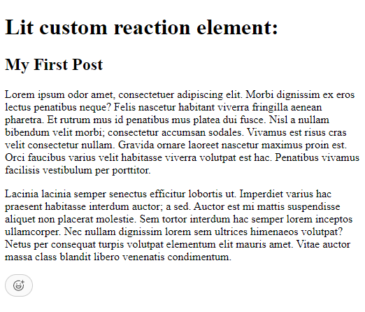

# xello-sfe-assignment

## Xello Senior Frontend Engineer assignment

There are two folders in this repository:

- xui-components which contains the reusable Lit component
- xello-dashboard which contains the sample Angular application that integrates the ui component

## Custom Reaction Component

### Viewing the Lit Component

There is a `reaction` component located in the `xui-components/src/components/reaction` folder. And index.html file has been created to test the component out:

1. Cd into the `xui-components` folder
2. run `npm i` to install the packages and dependencies
3. run `npm run dev` and open the url indicated in the console output
4. You should see something like this:

### Running Tests

1. Cd into the `xui-components` folder
2. run `npm run test`

### Running Storybook

1. Cd into the `xui-components` folder
2. run `npm run build-storybook` first
3. run `npm run storybook` to launch the tool

### Building for Angular

The Angular `xello-dashboard` app already has a copy of the xui-components.js module in its `src/assets` folder.
But the `npm run build-angular` script can be run, which will copy the output into src/assets.

## Angular Integration

### Setup

1. Cd into the `xello-dashboard` folder
2. run `npm i` to install the packages and dependencies
3. run `npm run start` to serve the angular application
